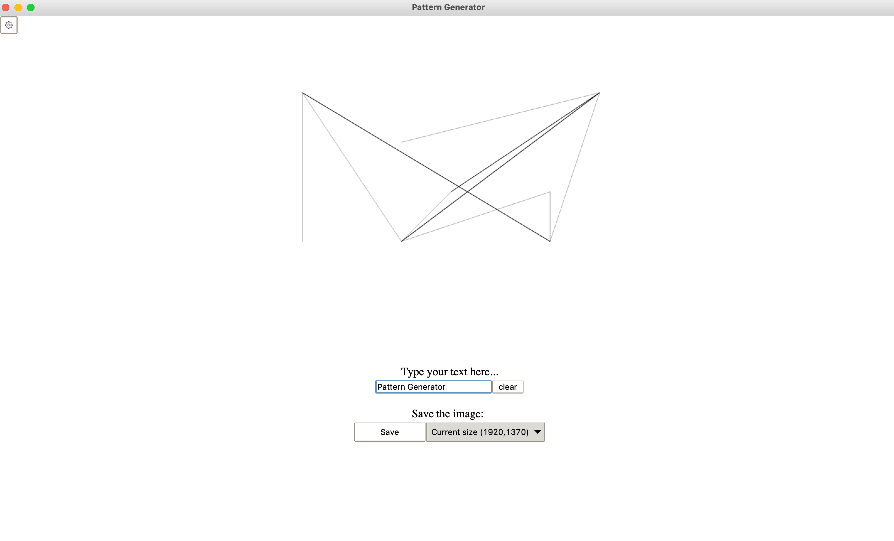
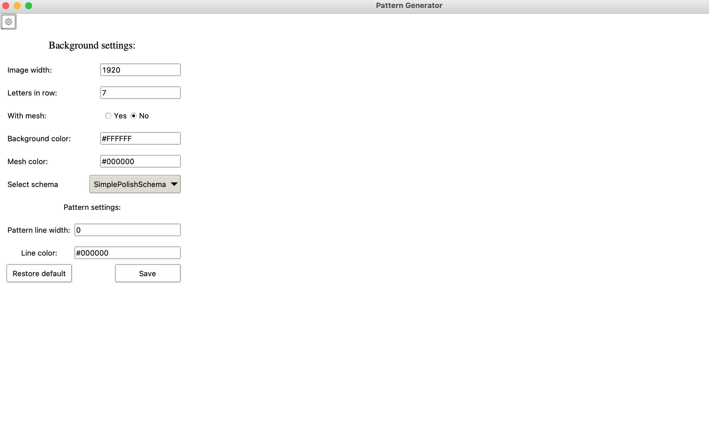

# Pattern-Generator

Create line patterns from text.

# General info
The app allows you to create different patterns based on provided text. 
You can also edit properties of the image such as:
- width
- letters in row
- colors
- letter mesh visibility 
- line width

For now app supports only polish alphabet.

## Example 1

## Example 2

